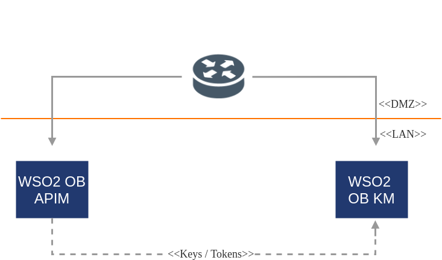

# Helm Chart for deployment of WSO2 Open Banking API Manager with WSO2 Open Banking Key Manager



## Table of Contents

* [Prerequisites](#prerequisites)
* [Quick Start Guide](#quick-start-guide)

## Prerequisites

* In order to use WSO2 Open Banking Helm resources, you need an active WSO2 Open Banking subscription. If you do not possess an active WSO2 Open Banking subscription already, you can contact us from [here](https://wso2.com/solutions/financial/open-banking/).<br><br>
 
* Install [Git](https://git-scm.com/book/en/v2/Getting-Started-Installing-Git), [Helm](https://github.com/kubernetes/helm/blob/master/docs/install.md)
(and Tiller) and [Kubernetes client](https://kubernetes.io/docs/tasks/tools/install-kubectl/) (compatible with v1.10) to run the 
steps provided in the following quick start guide.<br><br>

* An already setup [Kubernetes cluster](https://kubernetes.io/docs/setup).<br><br>

* Install [NGINX Ingress Controller](https://kubernetes.github.io/ingress-nginx/deploy/) using the following command:
  ```
  helm install stable/nginx-ingress --name nginx-wso2ob --set rbac.create=true --set controller.extraArgs.enable-ssl-passthrough=""
  ```

## Quick Start Guide    

>In the context of this document, <br>
>* `HELM_HOME` refers to the local copy of the [`wso2/kubernetes-open-banking`](https://github.com/wso2/kubernetes-open-banking/)
Git repository. <br>

#### 1. Clone Kubernetes Resources for WSO2 Open Banking Git repository.

```
git clone https://github.com/wso2/kubernetes-open-banking.git
```

#### 2. Provide Configurations.

a. The default product configurations are in the `<HELM_HOME>/ob-pattern-1/confs` folder. Change the
configurations as required.

b. Open the `<HELM_HOME>/ob-pattern-1/values.yaml` file and configure the following propeties: 

| Parameter                       | Description                                                                               |
|---------------------------------|-------------------------------------------------------------------------------------------|
| `subscription.username`         | Your WSO2 username                                                                        |
| `subscription.password`         | Your WSO2 password                                                                        |
| `spec`                          | Your Open Banking Specification (UK/Berlin)                                               |
| `namespace`                     | Kubernetes Namespace in which the resources are deployed                                  |
| `svcaccount`                    | Kubernetes Service Account in the `namespace` to which the product instance pods are attached |


#### 3. Deploy WSO2 Open Banking.

```
helm install --dep-up --name <RELEASE_NAME> <HELM_HOME>/ob-pattern-1 --namespace <NAMESPACE>
```

#### 4. Access Product Management Consoles.

a. Obtain the external IP (`EXTERNAL-IP`) of the Ingress resources by listing down the Kubernetes Ingresses:

  ```
  kubectl get ing --namespace <NAMESPACE>
  ```

Example:

```
NAME                                             HOSTS                        ADDRESS        PORTS     AGE
wso2ob-pattern-1-obam-gateway-ingress          wso2-obam-gateway           <EXTERNAL-IP>    80, 443     7m
wso2ob-pattern-1-obam-ingress                  wso2-obam                   <EXTERNAL-IP>    80, 443     7m
wso2ob-pattern-1-obkm-ingress                  wso2-obkm                   <EXTERNAL-IP>    80, 443     7m
```

b. Add the above host as an entry in the /etc/hosts file as follows:

  ```
  <EXTERNAL-IP>	wso2-obam-gateway
  <EXTERNAL-IP>	wso2-obam
  <EXTERNAL-IP>	wso2-obkm
  ```

c. Try navigating to `https://wso2obam/carbon`,`https://wso2obkm/carbon`  from your browser.

#### 5. Follow the documentation to use WSO2 Open Banking.

a. To deploy APIs
* [Deploying APIs for UK](https://docs.wso2.com/display/OB140/Deploying+APIs+for+UK)
* [Deploying APIs for Berlin](https://docs.wso2.com/display/OB140/Deploying+APIs+for+Berlin)

b. To try out the solution:
* [Try Out WSO2 Open Banking UK](https://docs.wso2.com/display/OB140/Try+Out+WSO2+Open+Banking+UK)
* [Try Out WSO2 Open Banking Berlin](https://docs.wso2.com/display/OB140/Try+Out+WSO2+Open+Banking+Berlin?src=sidebar)

For more information, see [WSO2 Open Banking documentation](https://docs.wso2.com/display/OB140).
